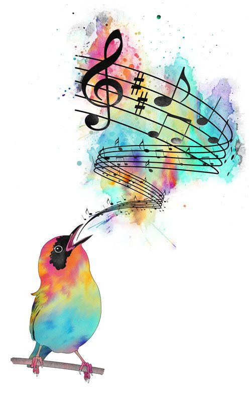

# hadssajordana7.github.io
Site para projetos de oficina de jogos.

**Quem Sou?**

  Meu nome é Hádssa Jordana, meus hobbes preferidos são:
desenhar, pintar, ler e resolver quebra-cabeças.
Me considero amante da arte, por isso pratico 
Programação e Arte no curso de jogos e por conta
própria.

# Contatos

1. Instagram
2. Facebook

- Número 1
- Número 2

## Jogos

1.<a href="https://raixasantos.github.io/AstralPlane/" target= "_blank">Astral Plane </a>

2.<a href="https://hadssajordana7.github.io/earthhalf" target= "_blank">Earth Half </a>

3.<a href="https://hadssajordana7.github.io/cozinhamaluca/" target= "_blank">Cozinha Maluca </a>

**Nome do Jogo** _Este jogo é..._ 

### Artes

1. Adicionar penas link (url)
[cubo](http://d26lpennugtm8s.cloudfront.net/stores/241/323/products/thunderv241-8dc7c99127561b058215132896980063-640-0.jpg)

2. Adicionar imagem da internet(url da imagem)

**Meus Desenhos Pessoais** (arquivo pc)

4. Adicionar imagem que também é link (arquivo + url)

5. Avançado: Adicionar imagem que também é link
              e que abre em uma nova janela

