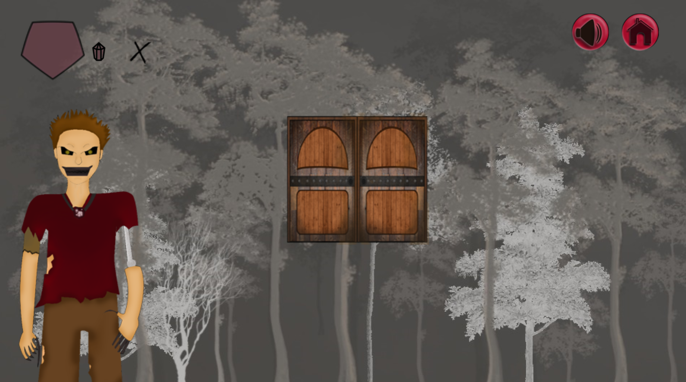
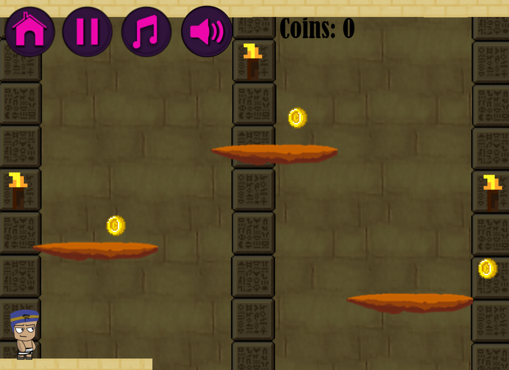
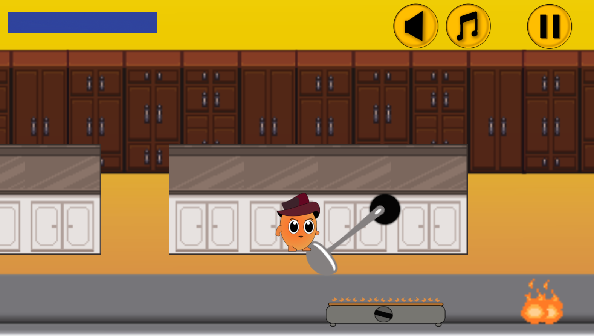
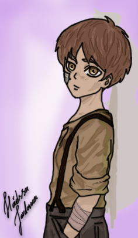
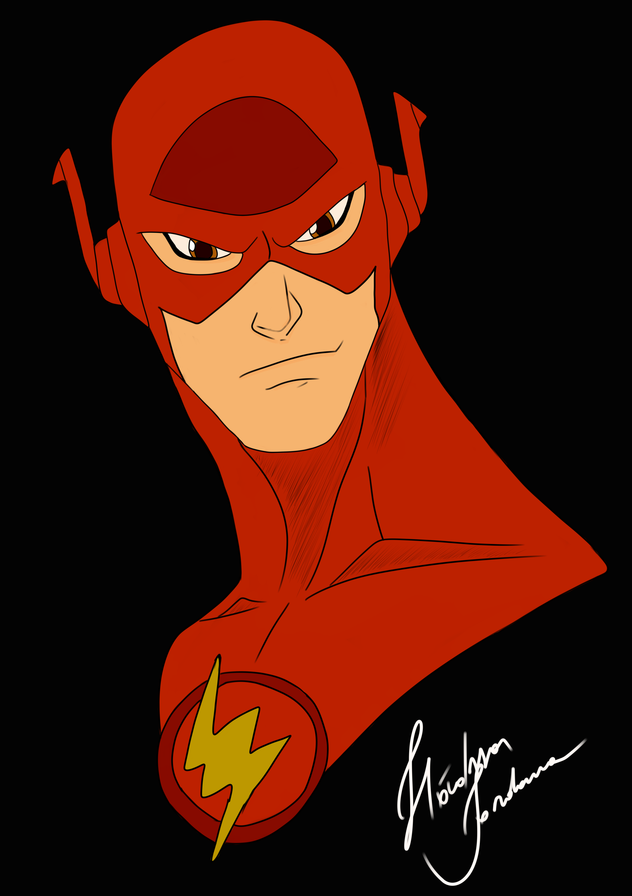

# hadssajordana7.github.io
Site para projetos de oficina de jogos.

**Quem Sou?**

  Meu nome é Hádssa Jordana, meus hobbes preferidos são:
desenhar, pintar, ler e resolver quebra-cabeças.
Me considero amante da arte, por isso pratico 
Programação e Arte no curso de jogos e também por conta
própria.

Curisidade: Eu amo escrever poesias. 

# Contatos e Contas

 
 
 

E-mail: hadssa.hadssajordana@outlook.com

## Jogos

<a href="https://raixasantos.github.io/AstralPlane/" target= "_blank">Astral Plane </a>

<a href="https://hadssajordana7.github.io/earthhalf" target= "_blank">Earth Half </a>

<a href="https://hadssajordana7.github.io/cozinhamaluca/" target= "_blank">Cozinha Maluca </a>

### Artes

**Meus Desenhos Pessoais** 

Minha iniciativa:
                     _"Continue pelos seus sonhos, você pode até o fim"_ 
    
                                        

